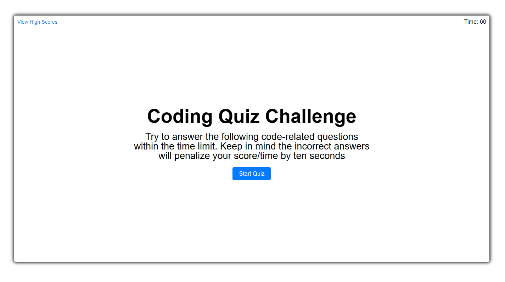

# My_Quiz

What all was done for creating my Quiz 

* Created README, INDEX.html, reset.css, style.css, script.js
* Created a container on HTML for my quiz.
* Added buttons for view high score, start quiz.
* Added a count down that starts when start quiz is clicked. If an answer is incorrect, it will reduce time by -10 seconds.
* Added startquiz function that when the start quiz button is pressed, it hides the start button and other elements. shuffles questions and presents the first question.
* Added a reset function that resets the next question.
* Added a Show Question function that displays the question and stores correct answers
* Added a select Answers function that will let the user know if there answer is correct or not, if not will reduce time by 10 seconds, then either display next question or call Endquiz function.
* Created endQuiz function that calculates the final score and displays your done with the quiz with your final score, with a submit form to submit your initials and score to high scores.
* Created a viewHighScores function that displays the users high scores with the option to go back or clear the highscores.
* Created a variable that hold the question and answer choices. 

##  Links

[Git Page](https://daniel-covington.github.io/My_Quiz/)

[Git Hub](https://github.com/Daniel-Covington/My_Quiz)

## Preview

The following image demonstrates the web application's appearance and functionality:

